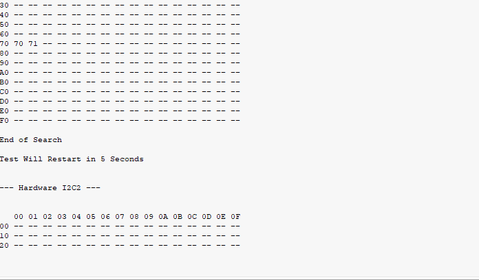

# Great-Cow-BASIC

This GIT contains the latest user contributed demonstrations.

# Hardware I2C2

This is an example of the running of the program.  This has discovery a device with the write and read addressses of 0x70 and 0x71 respectively.

Forgive the five seconds delay... this is a GIF not a video and this GIF does not have embedded timing.  :-)

