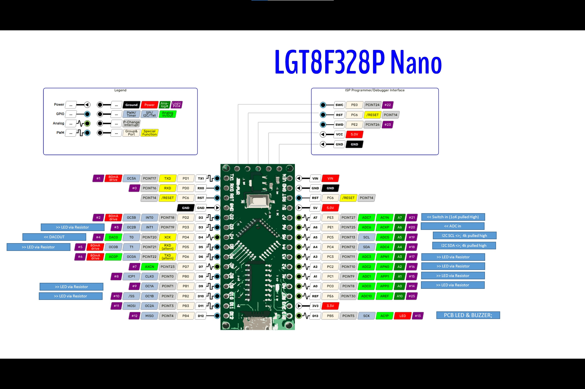

[cols=2, options="header,autowidth"]
|===
|*Index*|*Description*
|010  |Hello World  Turn on an LED  Port On. Port off
|020  |Blink an LED Blink an LED  Set Port On, Set Port off
|030  |Blink an LED another way Blink an LED another way  LED = !LED
|040  |Blink more than one LED  Blink LED's Four LEDS
|050  |Sequentially blink the LEDs with PulseOut  Blinks LEDs using PulseOut  Pulseout one LED
|060  |Sequentially blink the LEDs  Blinks LEDs using bitwise carry Rotate the four LEDs
|070  |Turn an LED on and off with a switch Turn an LED on and off  & when Switch Down turn on
|080  |Sequentially blink with ADC delay. Using 060 as the basis of this demonstration program
|090  |Debouncing a switch. Ensuring a switch does not bounce. Using 070  as the basis of this demonstration program
|100  |Reversible sequentially blinking the LEDs with a variable delay to serial terminal.  Using the LEDS and the POT  Read pot, set wait, then use code from 050
|110  |Reversible sequentially blinking the LEDs with a millis delay
|120  |Blinking the LED with an 8bit timer  Timer and LED Blink timer using timer0
|130  |Blinking the LED with an 10bit Pot value ( demo 100 was 10bit value) to serial terminal
|140  |Using EEPROM to store data EEPROM  Write/read EEPROM
|150  |Using an interrupt to toggle the LEDs
|160  |Playing sounds Sound Buzz a sound
|170  |I2C discovery to serial terminal
|180  |Showing graphics on the I2C GLCD I2C
|190  |Showing the ADC sensor value on the GLCD I2C
|200  |Showing the Sprites on the GLCD I2C
|210  |Generating a PWM square wave in software
|220  |Generating a PWM square wave using a fixed frequency and fixed duty on OC0B
|230  |Using PWM to generate a variable frequency/duty on OC0B
|240  |Using PWM to generate a variable frequency/duty on OC1A
|250  |Using PWM to generate a variable frequency/duty on OC1B
|260  |Using PWM in a variable PWM frequency or duty on many channels
|270  |Using an SPI GLCD
|280  |Show GUID in serial terminal using hardware serial
|280  |Show GUID in serial terminal using software serial
|===

For the connectivity the following diagram shows to overall connectivity.

